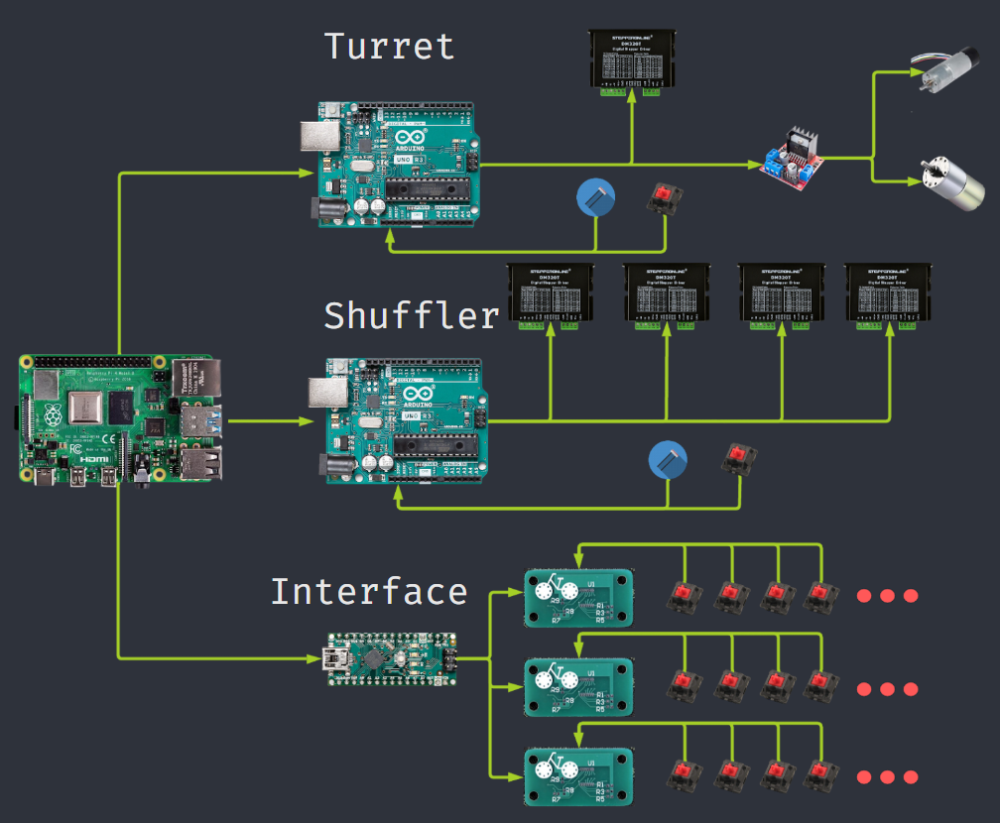

The B-I-K-E (Best in Kard Entertainment) Poker Table is a capstone project for the Northeastern University Electrical and Computer Engineering program. 

Collaborated with:
- [Connor Nelson](https://connornelson.info/)
- [Chris Swagler](https://www.linkedin.com/in/christopher-swagler/)
- [Tyler Passerine](https://www.linkedin.com/in/tyler-passerine-7ab51a1a2/)
- [Adin Moses](https://www.linkedin.com/in/adin-moses/)
- [Jackson Heun](https://www.linkedin.com/in/jack-heun-07b90017a/)
- [Professor Canek Fuentes](https://www.linkedin.com/in/canek-fuentes-79373711/)

An automated system that creates a seamless home-game experience by automating the tedious and repetitive tasks that occur during a game of cards while lowering the barrier of entry of knowledge for complex games, focusing on Texas Hold 'Em Poker as a proof of concept.

  <iframe width="560" height="315" src="https://www.youtube.com/embed/PsuNezDvL1I" frameborder="0" allow="accelerometer; autoplay; clipboard-write; encrypted-media; gyroscope; picture-in-picture" allowfullscreen></iframe>

**Update (April 11, 2023): We won first place at the [Northeastern ECE Capstone Expo](https://coe.northeastern.edu/news/teams-share-top-honors-in-electrical-and-computer-engineering-capstone-presentations/)!**

## System Overview
The main compute for the B-I-K-E Poker Table is a Rasperry Pi 4B. The Pi is operating on native Ubuntu and will run our main program written in Python (3.10.6). The main program will facilitate the Poker logic and delegate low-level control to Arduino Unos and an Arduino Nano via serial connection.

The Arduino Unos will control motors and sensors for both the Card-Turret and Auto-Shuffler. A custom communication layer lies between the Arduinos and the Pi to ensure correct command execution and completion. Each Arduino is running C++ utilizing our own custom-built Stepper-Motor Controller Library.

The Arduino Nano handles I/O control for the 4 button panels which enable players to provide input when playing Poker. Each button panel offers an I/O chip equipped with I2C and an interrupt pin. Our custom interfacing code translates the data over I2C into poker inputs for the Pi to operate upon.

    

<!-- 
## Design Reviews

### Card Dealer (Turret)

### Auto-Shuffler

#### Card Dispenser

#### Conveyor Belt

#### Card Elevator

### Button Panel

### Game Display
-->