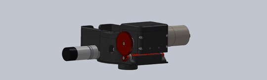
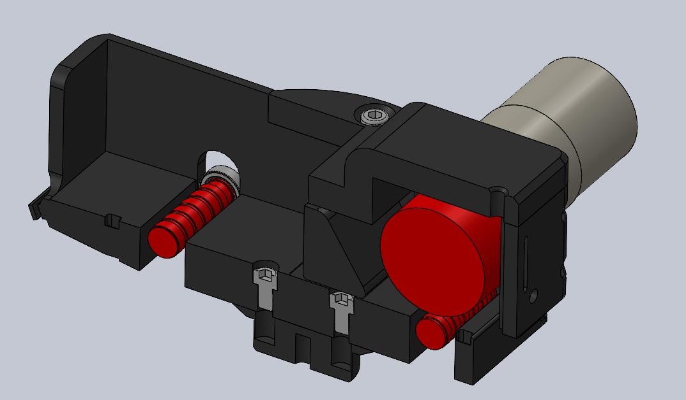
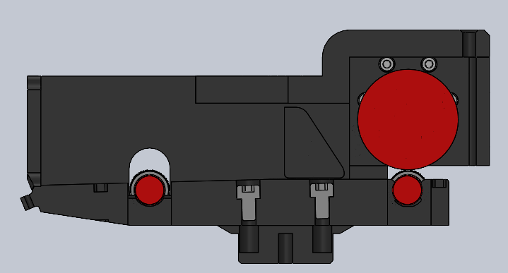
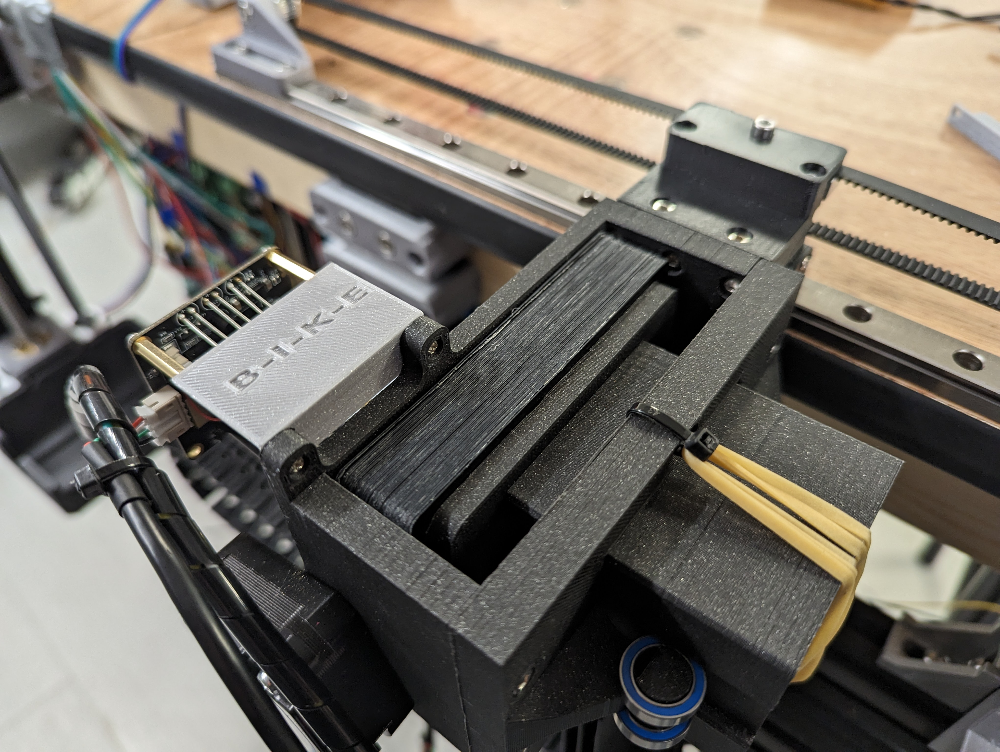
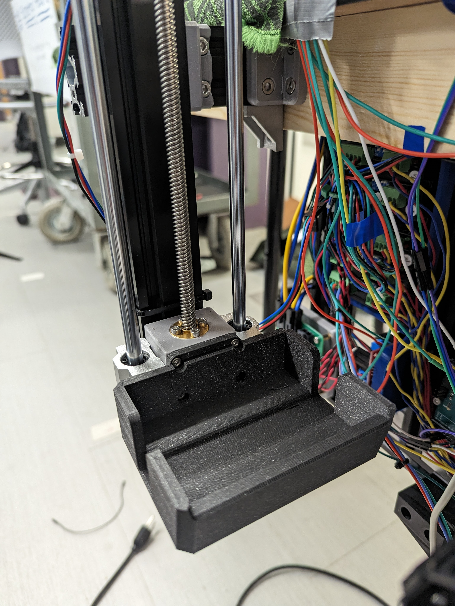

The B-I-K-E (Best in Kard Entertainment) Poker Table is a capstone project for the Northeastern University Electrical and Computer Engineering program. 

Collaborated with:
- [Connor Nelson](https://connornelson.info/)
- [Chris Swagler](https://www.linkedin.com/in/christopher-swagler/)
- [Tyler Passerine](https://www.linkedin.com/in/tyler-passerine-7ab51a1a2/)
- [Adin Moses](https://www.linkedin.com/in/adin-moses/)
- [Jackson Heun](https://www.linkedin.com/in/jack-heun-07b90017a/)
- [Professor Canek Fuentes](https://www.linkedin.com/in/canek-fuentes-79373711/)

An automated system that creates a seamless home-game experience by automating the tedious and repetitive tasks that occur during a game of cards while lowering the barrier of entry of knowledge for complex games, focusing on Texas Hold 'Em Poker as a proof of concept.

  <iframe
    src="https://www.youtube.com/embed/PsuNezDvL1I"
    style="position: absolute; top: 0; left: 0; width: 100%; height: 100%;"
    frameborder="0"
    allow="accelerometer; autoplay; clipboard-write; encrypted-media; gyroscope; picture-in-picture"
    allowfullscreen>
  </iframe>

**Update (April 11, 2023): We won first place at the [Northeastern ECE Capstone Expo](https://coe.northeastern.edu/news/teams-share-top-honors-in-electrical-and-computer-engineering-capstone-presentations/)!**

## Project Abstract
The BIKE team has designed and built a system that creates a seamless poker home-game experience by automating the tedious and repetitive tasks that occur during a game while lowering the barrier of entry of knowledge for a complex game. The system is complete with an automatic shuffler, automatic dealer, input button panels, and an accompanying computer application and screen. Poker is a common form of social entertainment both in the home and in dedicated gaming establishments that the BIKE system improves for all levels of players. The automated shuffler and dealer reduce responsibilities of the more knowledgeable players who are often burdened by handling the cards during home-games while the button panels and application provide a more seamless, easy-to-follow game for newer players that are often overwhelmed by the intricacies of the game.

## System Overview
The main compute for the B-I-K-E Poker Table is a Rasperry Pi 4B. The Pi is operating on native Ubuntu and will run our main program written in Python (3.10.6). The main program will facilitate the Poker logic and delegate low-level control to Arduino Unos and an Arduino Nano via serial connection.

The Arduino Unos will control motors and sensors for both the Card-Turret and Auto-Shuffler. A custom communication layer lies between the Arduinos and the Pi to ensure correct command execution and completion. Each Arduino is running C++ utilizing our own custom-built Stepper-Motor Controller Library.

The Arduino Nano handles I/O control for the 4 button panels which enable players to provide input when playing Poker. Each button panel offers an I/O chip equipped with I2C and an interrupt pin. Our custom interfacing code translates the data over I2C into poker inputs for the Pi to operate upon.

    

## Card Dealer (Turret)
The goal of the card dealer mechanism was to emulate a human dealer passing cards around the table to players and to locations on the table. The card dealer has 2 major design features:

1. The ability to hold a reservoir of playing cards and deal them one at a time
2. The capability to deal cards to any location on the table

The card dealer is equipped with a 2-stage indexer and flywheel system to accurately control card dispensing. The entire system is mounted on a rotating base for dealing cards to anywhere on the table and was equipped with a homing feature using a magnet and a hall-effect sensor to automatically calibrate the turret upon startup.

  
  
  
  

The dealer also offered mounting support for a photo-resistor and an LED to imitate a laser curtian for detecting when cards were fired, enabling one-card dealing. A double flywheel with opposing rollers was used to grip both the top and bottom of the card for straight shooting. The top roller was driven by a DC motor and had a diameter 4 times larger than the bottom roller, which spun 4 times as fast with a gear ratio to ensure the exit velocity of the card was linear.

## Auto-Shuffler
The auto-shuffler had a very simple goal, accept an unshuffled deck of cards, and output a shuffled deck of cards available to the users. Our approach to shuffling a deck was to shuffle in software, and then recreate the shuffled deck physically by scanning each card and rebuilding the deck. To accomplish this, we divided the problem of shuffling into 2 main parts:

1. Card detection and dispensing
2. Deck building

The first feature demands that the shuffler is able to detect what card it is dispensing in order to place it into the correct deck location. We did this with Computer Vision (See more below). The camera was mounted to a dispenser that was able to drop one card at a time. The second feature consisted of 2 parts, a conveyor belt that housed 52 individual slots for each card to be dispensed into and an elevator that brought the final shuffled deck to the playing area (3rd image below).

  
  
  

### Computer Vision
As part of the shuffler and overall software system we needed the ability to know the order that the deck was in before it was dealt. We added a camera onto the dispenser part of the shuffler. This allowed us to take a photo of each card before it was dispensed into its assigned slot. First a image processing suite runs in order to isolate the suit and the rank of the card into separate images by rotating and cropping them. They were then resized to 100x100 pixels and a neural network is then used in order to classify each one independently. This information is then passed into the user interface so that we can display it on screen. We used a standard CNN with a combination of convolution layers, maxpool layers and fully connected layers with a total parameter count of: 1,208,356. The suit CNN and the rank CNN were the same, just trained on different datasets. We trained each model for 20 epochs. We were able to successfully classify cards 98.7% of the time using our fully trained models.

## Project Conclusion
By automating many of the tasks required of players during the average home game as well as simplifying the flow of the game for new players, BIKE provides an improved home game experience for card game enthusiasts and beginners alike. The market research and user feedback taken while working on this project shows that the BIKE system is a valid proof of concept and indicates a potential market for this sort of high-end card game accessory amongst home game hosts and game store owners. The BIKE system shows the feasibility of a connected real-time system of mechatronics, firmware, software, and game visualization, which come together to create a seamless experience for all levels of players.