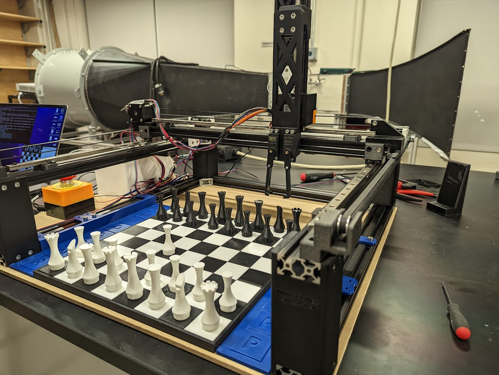
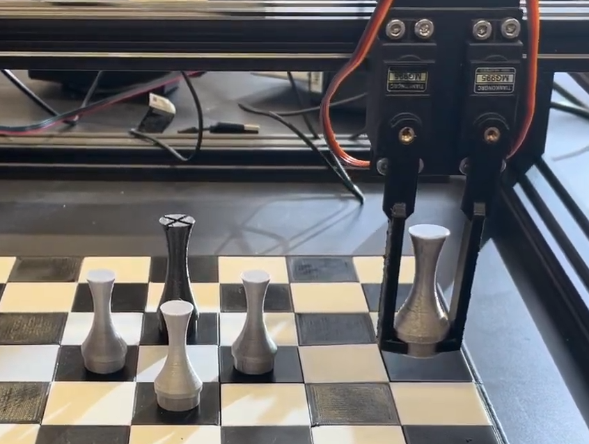
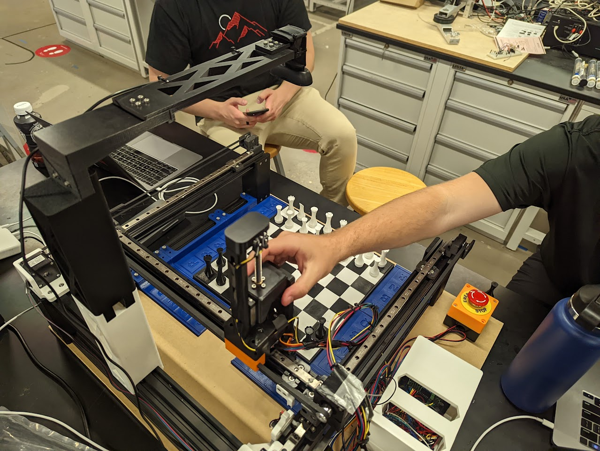
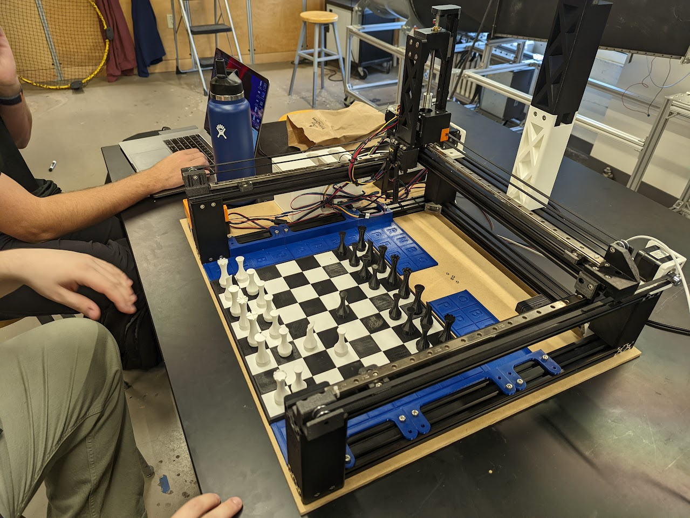

This robot utilized stepper motors, a camera, sensors, and a gantry style system to interact with the chess board and play against a human opponent.

## System Hardware
The robot's frame was assembled using aluminum extrusion and 3D printed parts. 2 motors were used to drive the X-axis, and 1 motor was used to drive the Y-axis (horizontally). Timing belts were used to transfer the motion from the stepper motors to the gantry sliding on linear rails. Limit switches were placed at the end of each axis to home the robot and ensure every movement was accurate during gameplay.

    

In order to interact with the chess pieces and board, a gripper was developed to interface with each of the pieces' stem. The gripper assembly was mounted to a lead screw in order to raise and lower the gripper.

    

## Computer Vision
A standard USB camera was used to track the game state in real time. Our initial approach was to attempt to classify each piece on every square after breaking up the image by pixels for each square. However, this approach was difficult to train a model for and was computationally expensive (especially on the Raspberry Pi). Instead, we decided to use a simpler approach by comparing a previous image of the board to the current image to determine which pieces had moved.

Since the beginning of a chess game is always the same and known to the computer, we can cheat a little bit with the computer vision in order to improve its performance. Instead of attempting to classify the piece, we only need to notice changes in the position compared to the previous position. For example if the squares `e2` and `e4` are marked as different from the starting position, we know that a white pawn started on `e2` and has moved to `e4`. Further, we don't even need to recognize a pieces color, only if a square is occupied or not. After segmenting the image into squares, we can compare the pixel values of each square to the previous image to determine if a piece has moved. Integrating this involved feeding the detected move through the chess engine and the robot's state. This allowed the robot to even detect illegal moves and request the human player to correct them.

    

This technique worked really well, despite uneven lighting conditions and shadows. We were also able to use alternate colors for the pieces since the image comparison was based on the pixel values and not the color of the pieces.

## Resetting the Board
Resetting a chess board after a game is such a simple task for humans it is often overlooked. However, when presented with the open-ended task, capable of making any decisions to optimize the process, the complexity of the task quickly becomes apparent and akin to travelling salesman.

    

The blue squares outlining the main board are reserved for captured pieces (and the extra queen). Whenever a capture occurs, the robot places the captured piece into the corresponding square.

When solving for an optimal path using a state-space exploration with A*, the space rapidly expands and is infeasible to solve. Our approach was to use a [greedy algorithm minimizing axes movement](https://github.com/Connor205/Chess-Robot-NURobotics/blob/main/mk1/resetFinder.py).
