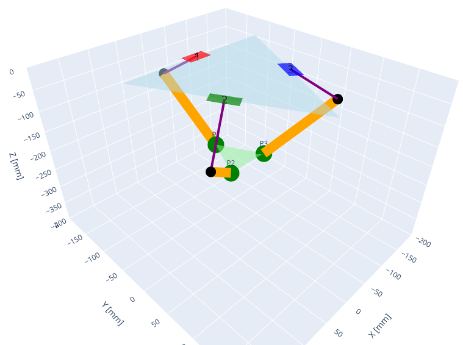
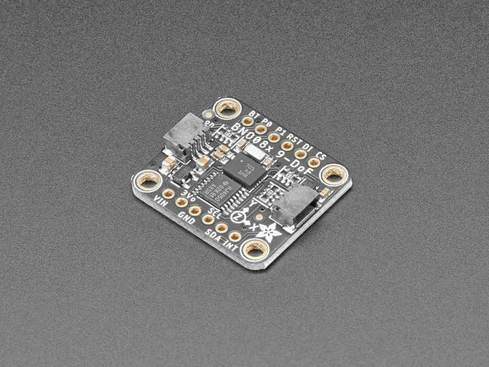
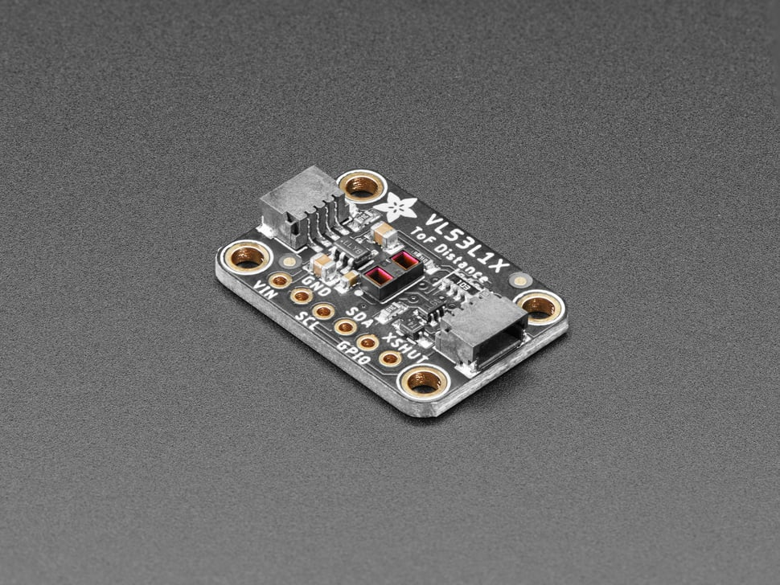

An open source ROS package for controlling delta robots with forward and inverse kinematics, trajectory generation, and visualization. Designed for public use and easy integration with new delta robot designs and applications.


## Kinematic Simulation
The robot's forward and inverse kinematics were first implemented in a jupyter notebook to visualize the robot's configuration space and workspace.

<div align="center">
    
    
</div>

The forward and inverse kinematics were then implemented in C++ following the approach described on the Trossen Robotics forum [1].

```cpp
void DeltaKinematics::forwardKinematics(const std::shared_ptr<DeltaFK::Request> request, std::shared_ptr<DeltaFK::Response> response) {
  // Locally save the request data (joint angles)
  float theta1 = request->joint_angles.theta1;
  float theta2 = request->joint_angles.theta2;
  float theta3 = request->joint_angles.theta3;
  float x = 0.0;
  float y = 0.0;
  float z = 0.0;

  float t = (this->SB - this->SP) * tan30 / 2;
  float y1 = -(t + this->AL * cos(theta1));
  float z1 = -this->AL * sin(theta1);
  float y2 = (t + this->AL * cos(theta2)) * sin30;
  float x2 = y2 * tan60;
  float z2 = -this->AL * sin(theta2);
  float y3 = (t + this->AL * cos(theta3)) * sin30;
  float x3 = -y3 * tan60;
  float z3 = -this->AL * sin(theta3);
  float dnm = (y2 - y1) * x3 - (y3 - y1) * x2;
  float w1 = y1 * y1 + z1 * z1;
  float w2 = x2 * x2 + y2 * y2 + z2 * z2;
  float w3 = x3 * x3 + y3 * y3 + z3 * z3;

  // x = (a1*z + b1)/dnm
  float a1 = (z2 - z1) * (y3 - y1) - (z3 - z1) * (y2 - y1);
  float b1 = -((w2 - w1) * (y3 - y1) - (w3 - w1) * (y2 - y1)) / 2.0;

  // y = (a2*z + b2)/dnm;
  float a2 = -(z2 - z1) * x3 + (z3 - z1) * x2;
  float b2 = ((w2 - w1) * x3 - (w3 - w1) * x2) / 2.0;

  // a*z^2 + b*z + c = 0
  float a = a1 * a1 + a2 * a2 + dnm * dnm;
  float b = 2 * (a1 * b1 + a2 * (b2 - y1 * dnm) - z1 * dnm * dnm);
  float c = (b2 - y1 * dnm) * (b2 - y1 * dnm) + b1 * b1 + dnm * dnm * (z1 * z1 - this->PL * this->PL);

  // discriminant
  float d = b * b - (float)4.0 * a * c;
  if (d < 0) {
    RCLCPP_ERROR(this->get_logger(), "DeltaFK: Invalid Configuration (%f, %f, %f) [rad]", theta1, theta2, theta3);
  } else {
    z = (-b + sqrt(d)) / (2*a);
    x = (a1 * z + b1) / dnm;
    y = (a2 * z + b2) / dnm;
  }

  // Update the response data (end effector position)
  response->x = x; // [mm]
  response->y = y; // [mm]
  response->z = z; // [mm]
}
```

```cpp
int DeltaKinematics::deltaFK_AngleYZ(float x0, float y0, float z0, float& theta) {
  float y1 = -0.5 * tan30 * SB; // Half base * tan(30)
  y0 -= 0.5 * tan30 * this->SP;    // shift center to edge
  // z = a + b*y
  float a = (x0 * x0 + y0 * y0 + z0 * z0 + this->AL * this->AL - this->PL * this->PL - y1 * y1) / (2 * z0);
  float b = (y1 - y0) / z0;
  // discriminant
  float d = -(a + b * y1) * (a + b * y1) + this->AL * (b * b * this->AL + this->AL);
  if (d < 0) return -1; // non-existing point
  float yj = (y1 - a * b - sqrt(d)) / (b * b + 1); // choosing outer point
  float zj = a + b * yj;
  theta = atan(-zj / (y1 - yj)) + ((yj > y1) ? M_PI : 0.0);
  return 0;
}

void DeltaKinematics::inverseKinematics(const std::shared_ptr<DeltaIK::Request> request, std::shared_ptr<DeltaIK::Response> response) {
  // Locally save the request data (end effector position)
  float x = request->x; // [mm]
  float y = request->y; // [mm]
  float z = request->z; // [mm]
  float theta1 = 0.0;
  float theta2 = 0.0;
  float theta3 = 0.0;

  int status = this->deltaFK_AngleYZ(x, y, z, theta1);
  if (status == 0) {
    status = this->deltaFK_AngleYZ(x * cos120 + y * sin120, y * cos120 - x * sin120, z, theta2);  // rotate coords to +120 deg
  } else {
    RCLCPP_ERROR(this->get_logger(), "DeltaIK: Non-existing point (%f, %f, %f) [mm]", x, y, z);
  }
  if (status == 0) {
    status = this->deltaFK_AngleYZ(x * cos120 - y * sin120, y * cos120 + x * sin120, z, theta3);  // rotate coords to -120 deg
  } else {
    RCLCPP_ERROR(this->get_logger(), "DeltaIK: Non-existing point (%f, %f, %f) [mm]", x, y, z);
  }

  // Update the response data (joint angles)
  response->joint_angles.theta1 = theta1; // [rad]
  response->joint_angles.theta2 = theta2; // [rad]
  response->joint_angles.theta3 = theta3; // [rad]
}
```


## End-Effector Sensors

| Sensor | Image | Description |
|--------|-------|-------------|
| [BNO055 IMU](https://www.adafruit.com/product/4646) |   | A 9-DOF sensor providing absolute orientation data with an on-board accelerometer, gyroscope, and magnetometer. |
| [VL53L1X ToF Sensor](https://www.adafruit.com/product/3967) |  | Capable of precise distance measurement within a range of 30 to 4000 mm, with up to a 50Hz update rate and a 27 degree field of view. |


## References
- [Delta Robot Kinematics](https://hypertriangle.com/~alex/delta-robot-tutorial/)