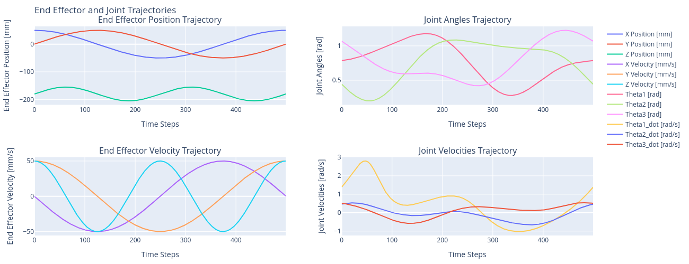

An open source ROS package for controlling delta robots with forward and inverse kinematics, trajectory generation, and visualization. Designed for public use and easy integration with new delta robot designs and applications.

## Robot Kinematics
The robot's forward and inverse kinematics were first implemented in a [jupyter notebook](https://github.com/Sharwin24/DeltaRobot/blob/main/delta_kinematics.ipynb) to visualize the robot's configuration space and workspace.

<div align="center">
  
  
</div>

The forward and inverse kinematics were then implemented in C++ following the approach described on the Trossen Robotics forum [1]. Access to the kinematics lets us plan paths in the joint space significantly easier and safer since the workspace is irregular. Once a joint trajectory is planned, the path can be verified to stay in the workspace

<div>
  <details>
    <summary>Forward and Inverse Kinematics C++ Implementation as ROS services</summary>
    
  ```cpp
  // this->AL = Active Link Length [mm]
  // this->PL = Passive Link Length [mm]
  // this->SB = Base Side Length [mm]
  // this->SP = Platform (EE) Side Length [mm]

  const float sqrt3 = sqrt(3.0);
  const float sin120 = sqrt3 / 2.0;
  constexpr float cos120 = -0.5;
  const float tan60 = sqrt3;
  constexpr float sin30 = 0.5;
  const float tan30 = 1 / sqrt3;

  void DeltaKinematics::forwardKinematics(const std::shared_ptr<DeltaFK::Request> request, std::shared_ptr<DeltaFK::Response> response) {
      // Locally save the request data (joint angles)
      float theta1 = request->joint_angles.theta1;
      float theta2 = request->joint_angles.theta2;
      float theta3 = request->joint_angles.theta3;
      float x = 0.0;
      float y = 0.0;
      float z = 0.0;

      float t = (this->SB - this->SP) * tan30 / 2;
      float y1 = -(t + this->AL * cos(theta1));
      float z1 = -this->AL * sin(theta1);
      float y2 = (t + this->AL * cos(theta2)) * sin30;
      float x2 = y2 * tan60;
      float z2 = -this->AL * sin(theta2);
      float y3 = (t + this->AL * cos(theta3)) * sin30;
      float x3 = -y3 * tan60;
      float z3 = -this->AL * sin(theta3);
      float dnm = (y2 - y1) * x3 - (y3 - y1) * x2;
      float w1 = y1 * y1 + z1 * z1;
      float w2 = x2 * x2 + y2 * y2 + z2 * z2;
      float w3 = x3 * x3 + y3 * y3 + z3 * z3;

      // x = (a1*z + b1)/dnm
      float a1 = (z2 - z1) * (y3 - y1) - (z3 - z1) * (y2 - y1);
      float b1 = -((w2 - w1) * (y3 - y1) - (w3 - w1) * (y2 - y1)) / 2.0;

      // y = (a2*z + b2)/dnm;
      float a2 = -(z2 - z1) * x3 + (z3 - z1) * x2;
      float b2 = ((w2 - w1) * x3 - (w3 - w1) * x2) / 2.0;

      // a*z^2 + b*z + c = 0
      float a = a1 * a1 + a2 * a2 + dnm * dnm;
      float b = 2 * (a1 * b1 + a2 * (b2 - y1 * dnm) - z1 * dnm * dnm);
      float c = (b2 - y1 * dnm) * (b2 - y1 * dnm) + b1 * b1 + dnm * dnm * (z1 * z1 - this->PL * this->PL);

      // discriminant
      float d = b * b - (float)4.0 * a * c;
      if (d < 0) {
        RCLCPP_ERROR(this->get_logger(), "DeltaFK: Invalid Configuration (%f, %f, %f) [rad]", theta1, theta2, theta3);
      } else {
        z = (-b + sqrt(d)) / (2*a);
        x = (a1 * z + b1) / dnm;
        y = (a2 * z + b2) / dnm;
      }

      // Update the response data (end effector position)
      response->x = x; // [mm]
      response->y = y; // [mm]
      response->z = z; // [mm]
    }

    int DeltaKinematics::deltaFK_AngleYZ(float x0, float y0, float z0, float& theta) {
      float y1 = -0.5 * tan30 * this->SB; // Half base * tan(30)
      y0 -= 0.5 * tan30 * this->SP;    // shift center to edge
      // z = a + b*y
      float a = (x0 * x0 + y0 * y0 + z0 * z0 + this->AL * this->AL - this->PL * this->PL - y1 * y1) / (2 * z0);
      float b = (y1 - y0) / z0;
      // discriminant
      float d = -(a + b * y1) * (a + b * y1) + this->AL * (b * b * this->AL + this->AL);
      if (d < 0) return -1; // non-existing point
      float yj = (y1 - a * b - sqrt(d)) / (b * b + 1); // choosing outer point
      float zj = a + b * yj;
      theta = atan(-zj / (y1 - yj)) + ((yj > y1) ? M_PI : 0.0);
      return 0;
    }

    void DeltaKinematics::inverseKinematics(const std::shared_ptr<DeltaIK::Request> request, std::shared_ptr<DeltaIK::Response> response) {
      // Locally save the request data (end effector position)
      float x = request->x; // [mm]
      float y = request->y; // [mm]
      float z = request->z; // [mm]
      float theta1 = 0.0;
      float theta2 = 0.0;
      float theta3 = 0.0;

      int status = this->deltaFK_AngleYZ(x, y, z, theta1);
      if (status == 0) {
        status = this->deltaFK_AngleYZ(x * cos120 + y * sin120, y * cos120 - x * sin120, z, theta2);  // rotate coords to +120 deg
      } else {
        RCLCPP_ERROR(this->get_logger(), "DeltaIK: Non-existing point (%f, %f, %f) [mm]", x, y, z);
      }
      if (status == 0) {
        status = this->deltaFK_AngleYZ(x * cos120 - y * sin120, y * cos120 + x * sin120, z, theta3);  // rotate coords to -120 deg
      } else {
        RCLCPP_ERROR(this->get_logger(), "DeltaIK: Non-existing point (%f, %f, %f) [mm]", x, y, z);
      }

      // Update the response data (joint angles)
      response->joint_angles.theta1 = theta1; // [rad]
      response->joint_angles.theta2 = theta2; // [rad]
      response->joint_angles.theta3 = theta3; // [rad]
    }
  ```
  </details>
</div>

<div id="workspace-container" style="display: flex; flex-direction: column; width: 90%; justify-content: center; align-items: center;">
</div>

### The Jacobian
The Modern Robotics [2] textbook details the process of deriving the Jacobian for a delta robot. The Jacobian is useful for converting end effector velocities to joint velocities.

<div style="overflow-x: auto; width: 100%;">
    \[
      \dot{\theta} = J^{-1}_{\theta} \cdot J_{p} \cdot \dot{p}
    \]
</div>

Using the Jacobian we can convert end-effector position trajectories into Joint velocity trajectories.

<div align="center" style="overflow-x: auto; width: 100%;">
  
</div>

<div>
  <details>
    <summary>Jacobian ROS C++ Implementation</summary>

  ```cpp
  std::pair<std::vector<double>, std::vector<double>> DeltaKinematics::calcAuxAngles(double theta1, double theta2, double theta3) {
    // First determine the end effector position using FK
    Point position = this->deltaFK(theta1, theta2, theta3);

    const double UP = (sqrt3 / 3) * this->SP;
    const Eigen::Vector3d P = {position.x, position.y, position.z};
    const Eigen::Vector3d D = {UP - this->AL, 0, 0};

    Eigen::Matrix3d C;
    for (int i = 0; i < 3; ++i) {
      double phi_i = this->phi[i];
      Eigen::Matrix3d R;
      R << std::cos(phi_i), std::sin(phi_i), 0,
        -std::sin(phi_i), std::cos(phi_i), 0,
        0, 0, 1;
      Eigen::Vector3d c_i = R * P + D;
      // Set the i-th column of C to c_i.
      C.col(i) = c_i;
    }
    double C_x2 = C(0, 1);
    double C_y2 = C(1, 1);
    double C_z2 = C(2, 1);
    double C_x3 = C(0, 2);
    double C_y3 = C(1, 2);
    double C_z3 = C(2, 2);
    // C_squared = c_xi^2 + c_yi^2 + c_zi^2
    double C_sqrd_2 = C_x2 * C_x2 + C_y2 * C_y2 + C_z2 * C_z2;
    double C_sqrd_3 = C_x3 * C_x3 + C_y3 * C_y3 + C_z3 * C_z3;
    // theta_3i = arccos(C_yi / PL)
    double t32 = acos(C_y2 / this->PL);
    double t33 = acos(C_y3 / this->PL);
    // k_numerator = c_xi ^ 2 + c_yi ^ 2 + c_zi ^ 2 - L ^ 2 - ELL ^ 2
    // k_denominator = 2 * L * ELL * sin(theta_3i)
    // theta_2i = arccos(k_numerator / k_denominator)
    double t22_numerator = C_sqrd_2 - this->AL * this->AL - this->PL * this->PL;
    double t22_denominator = 2 * this->AL * this->PL * sin(t32);
    double t23_numerator = C_sqrd_3 - this->AL * this->AL - this->PL * this->PL;
    double t23_denominator = 2 * this->AL * this->PL * sin(t33);
    double t22 = acos(t22_numerator / t22_denominator);
    double t23 = acos(t23_numerator / t23_denominator);
    // theta_1i is the actuated angles which were passed into the function
    // We only need to return the auxiliary angles
    return std::make_pair(std::vector<double>{theta2, t22, t23}, std::vector<double>{theta3, t32, t33});
  }

  Eigen::Matrix3d DeltaKinematics::calcJacobian(double theta1, double theta2, double theta3) {
    // The Jacobian matrix has 2 components: JTheta and Jp
    // Since this Jacobian will be used to compute the joint velocities, we need the inverse of JTheta
    // Jp * p_dot = JTheta * theta_dot -> theta_dot = JTheta_inv * Jp * p_dot

    // Obtain auxiliary angles
    auto aux_angles = this->calcAuxAngles(theta1, theta2, theta3);
    const std::vector<double> t1 = {theta1, theta2, theta3};
    const std::vector<double> t2 = aux_angles.first;
    const std::vector<double> t3 = aux_angles.second;
    double t22 = t2[1];
    double t23 = t2[2];
    double t32 = t3[1];
    double t33 = t3[2];

    // Jp Calculation
    auto J_ix = [this, &t1, &t2, &t3](int i) -> double {
      return sin(t3[i]) * cos(t2[i] + t1[i]) * cos(this->phi[i]) + cos(t3[i]) * sin(this->phi[i]);
    };
    auto J_iy = [this, &t1, &t2, &t3](int i) -> double {
      return -sin(t3[i]) * cos(t2[i] + t1[i]) * sin(this->phi[i]) + cos(t3[i]) * cos(this->phi[i]);
    };
    auto J_iz = [this, &t1, &t2, &t3](int i) -> double {
      return sin(t3[i]) * sin(t2[i] + t1[i]);
    };
    Eigen::Matrix3d Jp;
    for (int i = 0; i < 3; ++i) {
      Jp(i, 0) = J_ix(i);
      Jp(i, 1) = J_iy(i);
      Jp(i, 2) = J_iz(i);
    }

    // JTheta Calculation
    Eigen::Matrix3d JTheta;
    // Populate the diagonals with AL*sin(t2[i])*sin(t3[i])
    JTheta(0, 0) = this->AL * sin(theta2) * sin(theta3);
    JTheta(1, 1) = this->AL * sin(t22) * sin(t23);
    JTheta(2, 2) = this->AL * sin(t32) * sin(t33);

    // Invert JTheta
    Eigen::Matrix3d JTheta_inv = JTheta.inverse();
    return JTheta_inv * Jp;
  }

  DeltaJointVels DeltaKinematics::calcThetaDot(double theta1, double theta2, double theta3, double x_dot, double y_dot, double z_dot) {
    Eigen::Matrix3d J = this->calcJacobian(theta1, theta2, theta3);
    Eigen::Vector3d p_dot(x_dot, y_dot, z_dot);
    Eigen::Vector3d theta_dot = J * p_dot;
    DeltaJointVels joint_vels;
    joint_vels.theta1_vel = theta_dot(0);
    joint_vels.theta2_vel = theta_dot(1);
    joint_vels.theta3_vel = theta_dot(2);
    return joint_vels;
  }

  std::vector<EEVelocity> DeltaKinematics::computeGradient(const std::vector<Point>& position_data, double dt) {
    size_t n = position_data.size();
    std::vector<EEVelocity> velocities(n, {0.0, 0.0, 0.0});
    if (n == 0 || n == 1) return velocities;

    // Use forward difference for the first point
    velocities[0].x_vel = (position_data[1].x - position_data[0].x) / dt;
    velocities[0].y_vel = (position_data[1].y - position_data[0].y) / dt;
    velocities[0].z_vel = (position_data[1].z - position_data[0].z) / dt;

    // Use central difference for interior points
    for (size_t i = 1; i < n - 1; ++i) {
      velocities[i].x_vel = (position_data[i + 1].x - position_data[i - 1].x) / (2 * dt);
      velocities[i].y_vel = (position_data[i + 1].y - position_data[i - 1].y) / (2 * dt);
      velocities[i].z_vel = (position_data[i + 1].z - position_data[i - 1].z) / (2 * dt);
    }

    // Use backward difference for the last point
    velocities[n - 1].x_vel = (position_data[n - 1].x - position_data[n - 2].x) / dt;
    velocities[n - 1].y_vel = (position_data[n - 1].y - position_data[n - 2].y) / dt;
    velocities[n - 1].z_vel = (position_data[n - 1].z - position_data[n - 2].z) / dt;

    return velocities;
  }
  ```
  </details>
</div>

## End-Effector Sensors

| Sensor | Image | Description |
|--------|-------|-------------|
| [BNO055 IMU](https://www.adafruit.com/product/4646) |   | A 9-DOF sensor providing absolute orientation data with an on-board accelerometer, gyroscope, and magnetometer. |
| [VL53L1X ToF Sensor](https://www.adafruit.com/product/3967) |  | Capable of precise distance measurement within a range of 30 to 4000 mm, with up to a 50Hz update rate and a 27 degree field of view. |


## References
1. [Delta Robot Kinematics](https://hypertriangle.com/~alex/delta-robot-tutorial/)
2. [Modern Robotics](http://hades.mech.northwestern.edu/index.php/Modern_Robotics)