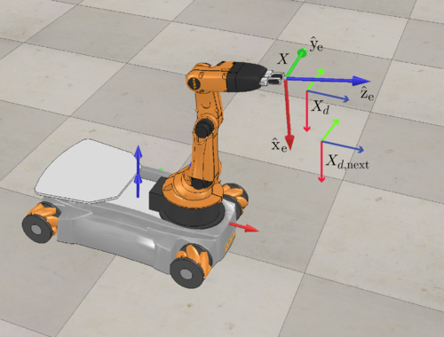
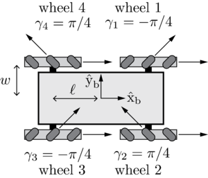

This project incorporates several robotics concepts to perform a pick and place task in simulation using a mecanum-wheeled mobile robot with a 5 degree-of-freedom robot arm.

<!--  -->
<div align="center">
    
</div>

## Omnidirectional Mobile Base Kinematics (Mecanum Wheels)
This robot uses mecanum wheels, which are omnidirectional wheels with 45-degree rollers that allow the robot to move in any direction without changing its orientation. When controlling the robot, we command the wheel velocities, which can be described by the following equation:

<div style="overflow-x: auto; width: 100%;">
    \[
    u_i=\frac{1}{r_i}\overbrace{\begin{bmatrix}1 & \tan\gamma_i\end{bmatrix}}^{\text{driving direction}}
    \underbrace{\begin{bmatrix}\cos\beta_i & \sin\beta_i \\ -\sin\beta_i & \cos\beta_i\end{bmatrix}}_{\text{linear velocity in wheel frame}} 
    \overbrace{\begin{bmatrix}-y_i & 1 & 0 \\ x_i & 0 & 1\end{bmatrix}}^{\text{linear velocity in body frame}} V_b
    \]
</div>

where:
- \\(u_i\\) is the wheel velocity
- \\(r_i\\) is the wheel radius
- \\(\gamma_i\\) is the angle of the roller relative to the wheel's driving direction
- \\(\beta_i\\) is the angle of the wheel relative to the body frame
- \\(x_i\\) and \\(y_i\\) are the x and y coordinates of the wheel relative to the body frame's origin
- \\(V_b\\) is the robot's 3D body twist, composed of the linear and angular velocity: \\([v_x, v_y, \omega]\\)

<!--  -->
<div align="center" style="background-color: rgba(255, 255, 255, 0.3); border-radius: 15px;">
    
</div>

## Trajectory Generation
There were two components to the trajectory generation:

1. End-Effector Reference Trajectory: Generating a desired end-effector trajectory for the robot to follow.
2. Time allocation: Generating the time and number of simulation steps per trajectory segment based on the desired end-effector trajectory.

These were accomplished using the trajectory generation functions provided by the `modern_robotics` library after splitting the sequence into 8 separate segments.

<div>
  <details>
    <summary>Trajectory Generation Python Function</summary>

```python
dt = 0.01  # [s]
total_time = 10  # [s]
traj_1_time = 0.21 * total_time  # Initial -> Pick_Standoff
traj_2_time = 0.01 * total_time  # Pick_Standoff -> Cube_Initial
traj_3_time = 0.07 * total_time  # Cube_Initial -> Gripper Closed
traj_4_time = 0.21 * total_time  # Gripper Closed -> Pick_Standoff
traj_5_time = 0.21 * total_time  # Pick_Standoff -> Place_Standoff
traj_6_time = 0.01 * total_time  # Place_Standoff -> Cube_Final
traj_7_time = 0.07 * total_time  # Cube_Final -> Gripper Open
traj_8_time = 0.21 * total_time  # Gripper Open -> Place_Standoff
trajectory_time = np.array([
    traj_1_time, traj_2_time, traj_3_time, traj_4_time,
    traj_5_time, traj_6_time, traj_7_time, traj_8_time
])
# steps per trajectory segment
# traj_steps = int(total_time * num_reference_configs / dt)
traj_steps = [
    int(t * num_reference_configs / dt) for t in trajectory_time
]
# Apply transformations for the waypoints we'll need
pick_standoff_config = cube_initial_config @ standoff_config
place_standoff_config = cube_final_config @ standoff_config
pick_grasp_config = cube_initial_config @ ee_grasping_config
place_grasp_config = cube_final_config @ ee_grasping_config
# Gripper states for the trajectory
gripper_states = []
# Trajectory 1: Initial -> Pick_Standoff (Screw Trajectory)
gripper_states.extend([0] * traj_steps[0])
traj_1 = mr.ScrewTrajectory(
    ee_initial_config, pick_standoff_config, trajectory_time[0], traj_steps[0], method=3
)
# Trajectory 2: Pick_Standoff -> Cube_Initial (Cartesian Trajectory)
gripper_states.extend([0] * traj_steps[1])
traj_2 = mr.CartesianTrajectory(
    pick_standoff_config, pick_grasp_config, trajectory_time[1], traj_steps[1], method=3
)
# Trajectory 3: Cube_Initial -> Gripper Closed
gripper_states.extend([1] * traj_steps[2])
traj_3 = mr.ScrewTrajectory(
    pick_grasp_config, pick_grasp_config, trajectory_time[2], traj_steps[2], method=3
)
# Trajectory 4: Gripper Closed -> Pick_Standoff (Cartesian Trajectory)
gripper_states.extend([1] * traj_steps[3])
traj_4 = mr.CartesianTrajectory(
    pick_grasp_config, pick_standoff_config, trajectory_time[3], traj_steps[3], method=3
)
# Trajectory 5: Pick_Standoff -> Place_Standoff (Screw Trajectory)
gripper_states.extend([1] * traj_steps[4])
traj_5 = mr.ScrewTrajectory(
    pick_standoff_config, place_standoff_config, trajectory_time[4], traj_steps[4], method=3
)
# Trajectory 6: Place_Standoff -> Cube_Final (Cartesian Trajectory)
gripper_states.extend([1] * traj_steps[5])
traj_6 = mr.CartesianTrajectory(
    place_standoff_config, place_grasp_config, trajectory_time[5], traj_steps[5], method=3
)
# Trajectory 7: Cube_Final -> Gripper Open
gripper_states.extend([0] * traj_steps[6])
traj_7 = mr.ScrewTrajectory(
    place_grasp_config, place_grasp_config, trajectory_time[6], traj_steps[6], method=3
)
# Trajectory 8: Gripper Open -> Place_Standoff
gripper_states.extend([0] * traj_steps[7])
traj_8 = mr.CartesianTrajectory(
    place_grasp_config, place_standoff_config, trajectory_time[7], traj_steps[7], method=3
)
trajectory = np.concatenate(
    (traj_1, traj_2, traj_3, traj_4, traj_5, traj_6, traj_7, traj_8), axis=0
)
```
</details>
</div>

## Odometry
Odometry is the process of estimating the mobile robot's pose by integrating the wheel velocities. The robot's pose is represented by the chassis configuration \\([\phi, x, y]\\), where \\(\phi\\) is the orientation and \\(x, y\\) are the position in the world frame. We can compute the body twist \\(V_b\\) using the wheel velocities \\(\dot{\theta}\\), the timestep \\(\Delta t\\), and the chassis configuration \\( F=pinv(H(0))\\):

<div style="overflow-x: auto; width: 100%;">
\[
\dot{\theta} = \Delta\theta / \Delta t \\\
V_b = \underbrace{H(0)^{\dagger}}_{F} \cdot \dot{\theta}
\]
</div>

The body twist \\(V_b\\) can be integrated to get the displacement \\(T_{bk} = exp([V_b])\\), which is then applied to the chassis configuration to get the new pose.

The odometry function computes the new chassis configuration based on the difference between the current and previous wheel configurations assuming a constant velocity between the two wheel configurations \\((\Delta t = 1)\\).

<div>
  <details>
    <summary>Odometry Python Function</summary>

```python
def odometry(chassis_config: np.array, delta_wheel_config: np.array) -> np.array:
    """
    Using Odometry, a new chassis configuration is computed based on the
    difference between the current and the previous wheel configuration.

    Args:
        chassis_config (np.array): The current chassis configuration [phi, x, y]
        delta_wheel_config (np.array): The difference in wheel configuration

    Returns:
        np.array: The new chassis configuration [phi, x, y]
    """
    phi, x, y = chassis_config
    # delta_theta is the difference in wheel angles
    # Since we are assuming constant wheel speeds, dt = 1
    dt = 1  # Use actual timestep between wheel displacements for non-constant speeds
    theta_dot = delta_wheel_config / dt
    # Calculate the Body twist using the pinv(H0) and theta_dot
    V_b = RC.F @ theta_dot
    # Integrate to get the displacement: T_bk = exp([V_b6])
    V_b6 = np.array([0, 0, *V_b, 0])
    T_bk = mr.MatrixExp6(mr.VecTose3(V_b6))
    T_sk = RC.T_sb(phi, x, y) @ T_bk
    new_phi = np.arctan2(T_sk[1, 0], T_sk[0, 0])
    new_chassis_config = np.array([
        new_phi,
        T_sk[0, 3],
        T_sk[1, 3]
    ])
    return new_chassis_config
```
</details>
</div>

## Task-Space Feedforward & Feedback Control
To perform the pick and place task, we need to implement a control law that can track a desired end-effector trajectory. The control law is given by:

<div style="overflow-x: auto; width: 100%;">
\[
V_e(t) = \overbrace{[Ad_{X^{-1}X_d}]V_d(t)}^{\text{Feedforward}} + K_pX_{err}(t) + K_i \int X_{err}(t)
\]
</div>

where:
- \\(V_e(t)\\) is the error twist required to track the desired trajectory
- \\(X\\) is the current end-effector configuration
- \\(X_d\\) is the desired end-effector configuration
- \\(V_d(t)\\) is the desired end-effector twist
- \\(K_p\\) is the proportional gain matrix
- \\(K_i\\) is the integral gain matrix
- \\(X_{err}(t)\\) is the error between the current and desired end-effector configurations

<div>
  <details>
    <summary>Feedback Control Python Function</summary>

```python
def feedback_control(X, Xd, Xd_next, Kp, Ki, control_type: str = 'FF+PI', dt: float = 0.01) -> tuple:
    """
    Calculate the kinematic task-space feedforward plus feedback control law.
    V(t) = [Adjoint(inv(X)*Xd)]V_d(t) + Kp*X_err(t) + Ki*integral(X_err(t))
    Args:
        X (np.array): The current actual end-effector configuration (T_se)
        Xd (np.array): The current end-effector reference configuration (T_se,d)
        Xd_next (np.array): The end-effector reference configuration at the next timestep in the reference trajectory
        Kp (np.array): The Proportional gain matrix
        Ki (np.array): The Integral gain matrix
        control_type (str, optional): The type of simulation. Defaults to 'FF+PI'. ['FF+PI', 'P', 'PI']
        dt (float, optional): The timestep between reference trajectory configs. Defaults to 0.01.
    Returns:
        tuple: A tuple containing the twist V and the error X_err
    """
    X_err = mr.se3ToVec(mr.MatrixLog6(mr.TransInv(X) @ Xd))
    Vd = mr.se3ToVec((1/dt) * mr.MatrixLog6(mr.TransInv(Xd) @ Xd_next))
    if control_type == 'FF+PI':
        V = mr.Adjoint(mr.TransInv(X) @ Xd) @ Vd + (Kp @ X_err) + (Ki @ (X_err * dt))
    elif control_type == 'P':
        V = (Kp @ X_err)
    elif control_type == 'PI':
        V = (Kp @ X_err) + (Ki @ (X_err * dt))
    else:
        print(f'Invalid sim_type: {control_type}, using FF+PI')
        V = mr.Adjoint(mr.TransInv(X) @ Xd) @ Vd + (Kp @ X_err) + (Ki @ (X_err * dt))
    return V, X_err
```
</details>
</div>

## Singularity Avoidance
During trajectory generation/planning, there are desired configurations that can bring the robot arm close to singularities in the robot's configuration space. To avoid any singularities, whenever the joint speeds are computed for the configuration at the next timestep, If the movement sends a joint past its limit, the column corresponding to that joint is set to zero within the Jacobian when computing the joint speeds to avoid using that joint to acheive the desired configuration.

```python
class RobotConstants:
    @property
    def F(self) -> np.array:
        """F = pinv(H0)"""
        R = self.R
        L = self.L
        W = self.W
        return (R / 4) * np.array([
            [-1 / (L + W), 1/(L + W), 1/(L + W), -1/(L + W)],
            [1, 1, 1, 1],
            [-1, 1, -1, 1]
        ])
    
    def Je(self, arm_thetas: np.array, violated_joints: list[int] = []) -> np.array:
        """
        Compute the Mobile Manipulator Jacobian given the arm joint angles and the list of joints that break joint limits.

        Args:
            arm_thetas (np.array): The arm joint angles [rad]
            violated_joints (list[int], optional): List of joints by ID that are out of joint limits. Defaults to [].

        Returns:
            np.array: The Mobile Manipulator Jacobian (6x9)
        """
        # 6x5 Jacobian Matrix for the arm
        J_arm = mr.JacobianBody(self.B, arm_thetas)
        # If any joints are violated, set the corresponding column to 0
        for j in violated_joints:
            J_arm[:, j] = 0
        # 6x4 Jacobian Matrix for the base
        F_6 = np.array([
            np.zeros(4),
            np.zeros(4),
            self.F[0],
            self.F[1],
            self.F[2],
            np.zeros(4)
        ])
        # J_base = [Adjoint(inv(T_0e) * inv(T_b0))] * F_6
        J_base = mr.Adjoint(
            mr.TransInv(self.T_0e(arm_thetas)) @ mr.TransInv(self.T_b0)
        ) @ F_6
        # Mobile Manipulator Jacobian
        Je = np.hstack((J_base, J_arm))
        return Je
```