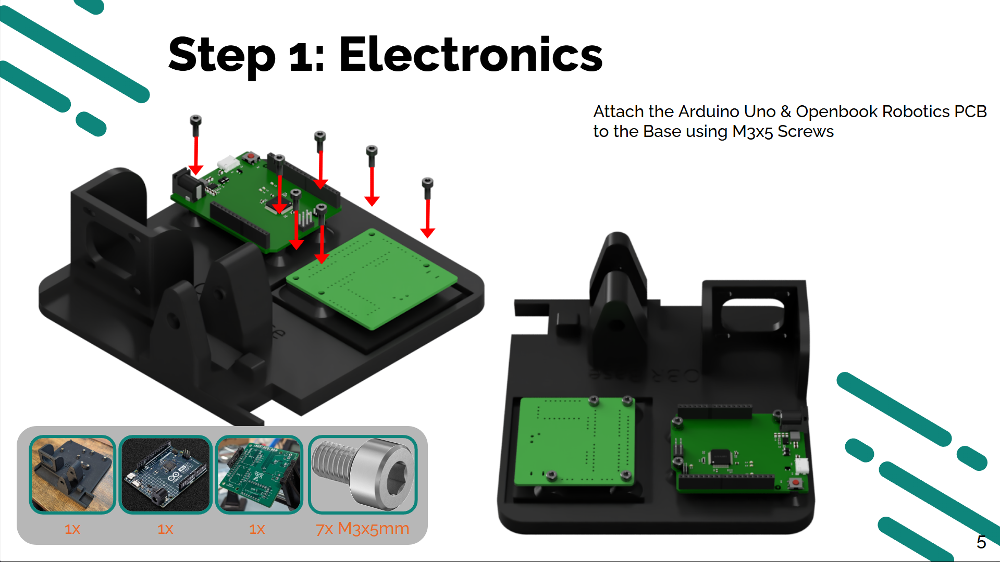
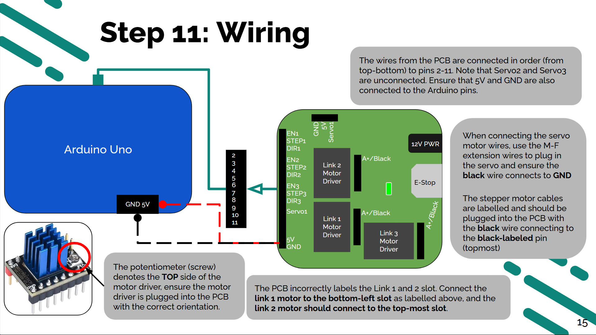
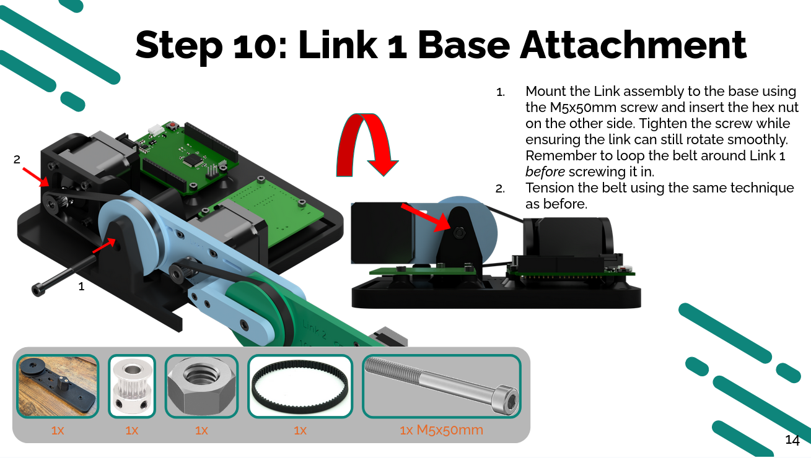
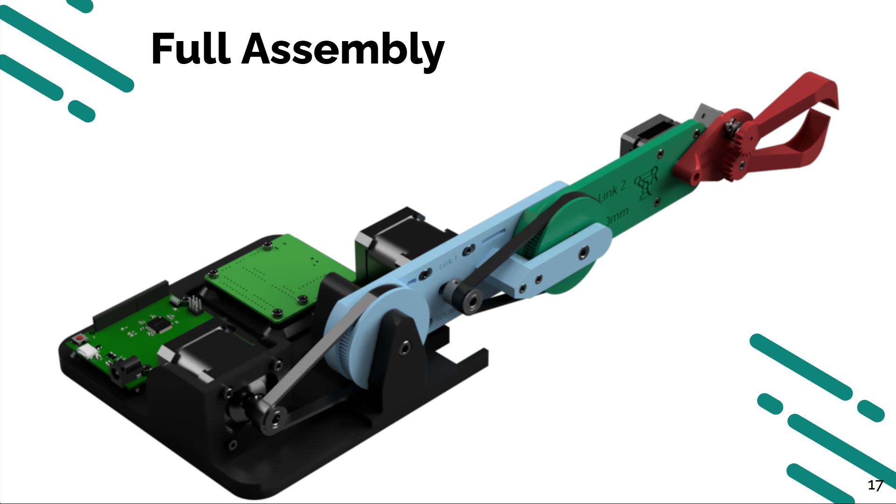

An educational kit designed to teach the fundamentals of kinematics and dynamics. The kit is intended to accompany the course ME3460: Robot Dynamics & Control at Northeastern University. The kit is a physical representation of the final project, which is currently done purely through MATLAB simulation.

## Kit Design
The robot is a 3-link planar manipulator with 3 degrees of freedom. The end effector is a simple gripper that can grab small objects.

The entire kit is composed of 3D printed parts, and off-the-shelf hardware/electronics. Students can assemble the kit without any soldering and with minimal tools.

<div align="center" style="display: flex; flex-wrap: wrap; justify-content: center; gap: 15px;">
  
  
  
  
</div>

The instructions are laid out in simple steps, akin to LEGO instructions. A custom PCB was developed to simplify the wiring process and off the shelf stepper motors and drivers were used for easy integration with the Arduino microcontroller.

<div align="center">
    
</div>

## Software

In order to control the robot arm, a custom library was written in C++ to handle the microstepping. The library followed the same technique as the AccelStepper library to enable concurrent motion of multiple motors at a time in addition to applying acceleration and velocity profiles. A custom library meant students could easily write and implement their own motion profiles without having to deal with the hardware specifics.

```cpp
void LinkStepperMotor::computeNewPulseInterval() {
	// Acceleration curve is split into 3 parts: acceleration, steady-state, deceleration
	int totalSteps = abs(this->targetPosition - this->previousTargetPosition);
	int stepsRemaining = this->getStepsRemaining();
	int stepsCompleted = totalSteps - stepsRemaining;
	int n1 = totalSteps / 3;
	int n2 = 2 * n1;
	uint16_t speedSPS = this->currentSpeedSPS;
	// Determine which range we are in to apply the correct part of the acceleration curve
	if (stepsCompleted <= n1) {
		// Acceleration
		// a(n) = k * n1 + a0
		// v(n) = 0.5 * k * n^2 + a0 * n + v0
		speedSPS = (0.5f * this->accelerationRate * pow(stepsCompleted, 2)) + (this->initialAcceleration * stepsCompleted) + this->initialSpeedSPS;
	} else if (stepsCompleted >= n1 && stepsCompleted <= n2) {
		// Steady-state
		// a(n) = a_max = k * n1 + a0
		// v(n) = (k * n1 + a0) * n - 0.5 * k * n1^2 + v0
		speedSPS = ((this->accelerationRate * n1 + this->initialAcceleration) * stepsCompleted) - (0.5f * this->accelerationRate * pow(n1, 2)) + this->initialSpeedSPS;
	} else { // (stepsCompleted >= n2)
		// Deceleration
		// a(n) = -k * n + k * n2 + a_max
		// v(n) = -0.5 * k * n^2 + (k * n1 + k * n2 + a0) * n - 0.5 * k * (n1^2 + n2^2) + v0
		speedSPS = (-0.5f * this->accelerationRate * pow(stepsCompleted, 2))
			+ (this->accelerationRate * n1 + this->accelerationRate * n2 + this->initialAcceleration) * stepsCompleted
			- (0.5f * this->accelerationRate * (pow(n1, 2) + pow(n2, 2)))
			+ this->initialSpeedSPS;
	}
	this->setSpeedSPS(speedSPS);
}
```