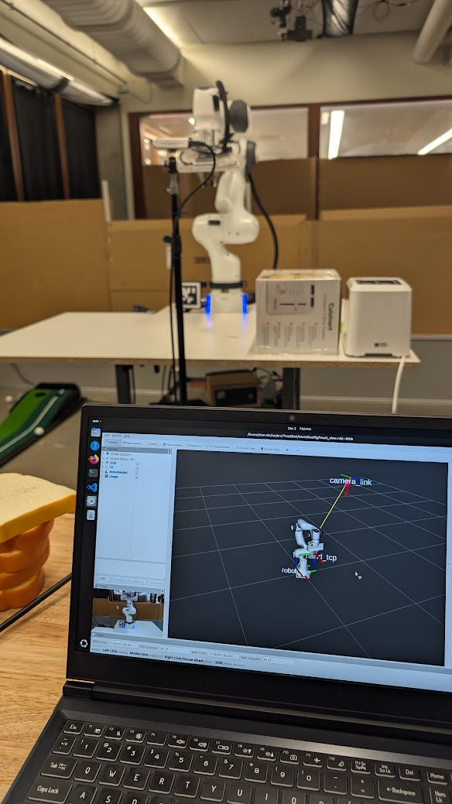

Using a 7-DoF Franka Emika Panda Robot Arm, we developed a pick and place sequence using an Intel Realsense camera for identifying april tags.

  <iframe
    src="https://www.youtube.com/embed/XGcdhWRo-iU"
    style="position: absolute; top: 0; left: 0; width: 100%; height: 100%;"
    frameborder="0"
    allow="accelerometer; autoplay; clipboard-write; encrypted-media; gyroscope; picture-in-picture"
    allowfullscreen>
  </iframe>

## Robot Arm Control
The Franka Emika Panda Robot Arm has a ROS package `franka_ros` which allows us to control the robot arm using the Moveit API. 
The Moveit API offers services and action servers to faciliate trajectory planning, end-effector operation, and motion profiling. 

Prior to the start of the project, we developed our own API that offered higher level tasks such as pose-to-pose motions, end-effector operations, and cartesian path planning.
This API enabled a ROS node to be connected to the MoveIt API and send motion requests. 

## Computer Vision
The Intel Realsense D435i camera has a ROS package `realsense` that enables the camera to publish depth and color images. 
In order to identify april tags, we used the `apriltag_ros` package which subscribes to the camera images and publishes the detected tags which each
have a unique ID. The tags were used to locate the positions of objects in the scene as well as localize the camera frame from the robot's base frame.

## Scene planning
The scene around the robot was carefully planned to ensure every object that the robot needed to interact with was within its workspace.
Planning was done by hand and with simulation (RViz) to explore the robot's workspace.

    

